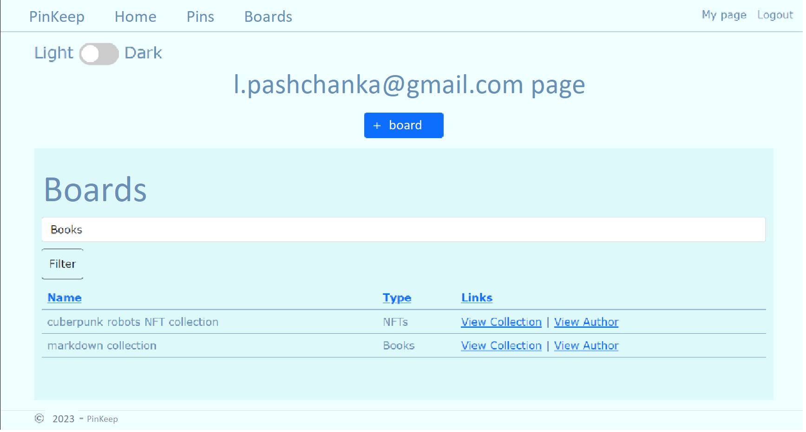

# PinKeep

* 1 [Введение](#1-введение)
* 2 [Требования пользователя](#2-требования-пользователя)
    * 2.1 [Программные интерфейсы](#21-программные-интерфейсы)
    * 2.2 [Интерфейс пользователя](#22-интерфейс-пользователя)
    * 2.3 [Характеристики пользователей](#23-характеристики-пользователей)
* 3 [Системные требования](#3-системные-требования)
    * 3.1 [Функциональные требования](#31-функциональные-требования)
    * 3.2 [Нефункциональные требования](#32-нефункциональные-требования)
    * 3.3 [Атрибуты качества](#33-атрибуты-качества)

## 1. Введение

PinKeep это web-приложения для управления личными досками. Элементы досок в тексте ниже называются пинами. Приложение является аналогом Pinterest.

## 2. Требования пользователя

### 2.1 Программные интерфейсы
Хранение изображений должно осуществляться с помощью сервиса - [cloudinary](https://cloudinary.com/).

### 2.2 Интерфейс пользователя
Каждая страница (в заголовке сверху) имеет ссылки на главную страницу сайта, страницу со всеми существующими пинами, страницу со всеми существующими досками. Если пользователь аутентифицирован в заголовке имеется ссылка на страницу пользователя и ссылка на выход из аккаунта, если пользователь не аутентифицирован в заголовке содержиться ссылка на страницу регистрации или входа.
* Главная страница сайта содержит: облако тэгов, список из 5 недавно созданных досок.

* Страница всех пинов содержит таблицу пинов с нумерацией страницы.

* Страница досок содержит список всех существущих досок с возможностью фильтрации, сортировки и нумерации страниц.

* Страница пользователя содержит список всех досок пользователя, если у пользователя нет созданных досок отображает сообщение об отсутствии досок. Так же страница пользователя содержит кнопку создания новой доски и чекбокс смены темы сайта.

* Страница доски содержит: название доски, тип доски, описание, ссылку на автора доски, таблицу всех пинов данной доски. Так же если пользователь просматривает созданную им доску отображается кнопка добавления нового пина, кнопка удаления доски.

* Страница пина содержит: изображение, описание, список тегов, количество лайков, кнопку лайка (для аутентифицированных пользователей), комментарии, поле для ввода комментария (для аутентифицированных пользователей).

### 2.3 Характеристики пользователей
Неаутентифицированные пользователи имеют доступ только в режиме чтения (они не могут создавать доски и пины, не могут оставлять комментарии и лайки). Аутентифицированные пользователи не-админы имеют доступ к созданию, редактированию, удалению досок или пинов, а так же могут комментировать и оценивать пины.
Пользователь админ может управлять пользователями — просматривать, блокировать, разблокировать, удалять, добавлять в админы, удалять из админов. Админ видит все страницы как их автор (например, админ может открыть доску другого пользователя и добавить в нее пины; по сути, админ является владельцем всех досок и всех пинов). Только админ или создатель доски или пина может ими манипулировать (редактировать, добавлять, удалять).

## 3. Системные требования
Наличие браузера и выхода в интернет.

### 3.1 Функциональные требования
Пользователи могут зарегистрироваться и аутентифицироваться через сайт. У каждого пользователя есть личная страница, на которой он управляет своими досками (создает, удаляет, редактирует) — каждая доска в списке это ссылка на страницу доски, которая содержит таблицу пинов с нумерацией и возможностью создать новый пин, удалить или отредактировать существующий. Каждая доска имеет название, описание, тему, обязательного изображения.
Все пины имеют тэги (пользователь может ввести несколько тэгов; поддерживается автодополнение — когда пользователь начинает что-то вводить, ему показывается список из тэгов с соответствующими начальными буквами из тех, что уже есть в базе данных). Когда пин открыт для просмотра (автором или другим пользователем) внизу отображаются комментарии. Комментарии линейные, добавляются всегда только в конец. Комментарии обновляются автоматически — когда страница открыта и кто-то другой добавил комментарий, он появляется автоматически. Каждый пин также содержит лайки (не более одного от одного пользователя на каждый пин). Сайт поддерживает две визуальные темы: светлую и темную (пользователь выбирает и выбор сохраняется).

### 3.2 Нефункциональные требования
Для реализации проекта надо использовать язык программирования C# и его фреймворк ASP.NET Core MVC. База данных MS SQL Server, для взаимодействия с базой данных использовать ORM EntityFramework. SignalR использовать для реализации комментариев. Так же необходимо применить JavaScript для реализации действий на стороне клиента.
Использовать Bootstrap. Поддержка разных разрешений экранов.

### 3.3 Атрибуты качества
Web приложение должно обладать хорошей производительностью и быстро загружаться в брузере.
