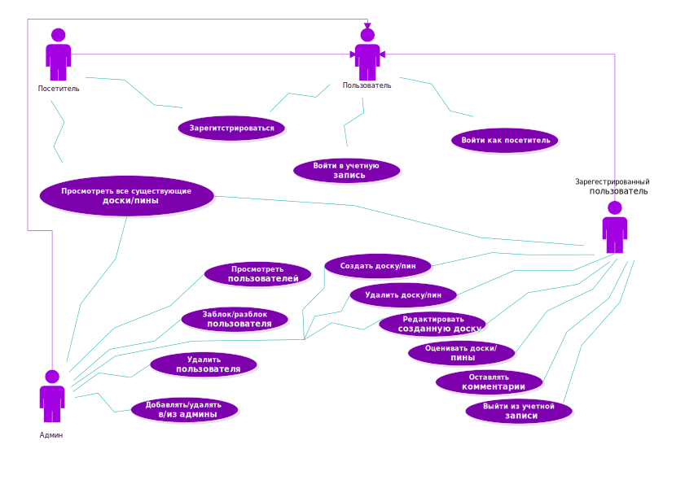

#  Use Case

# Глоссарий

| Термин | Определение |
|:--|:--|
| Пользователь | Человек, использующий приложение |
| Зарегистрированный пользователь | Пользователь, ранее зарегистрировавшийся в приложении |
| Посетитель | Пользователь, использующий приложение без авторизации | 
| Админ | Администратор сайта PinKeep |

# Поток событий

# Содержание
[1 Поток событий](#1-поток-событий)  
[1.1 Войти в свою учётную запись](#11-войти-в-свою-учётную-запись)  
[1.2 Зарегистрироваться](#12-зарегистрироваться)    
[1.3 Войти как посетитель](#13-войти-как-посетитель)  
[1.4 Просмотреть список всех досок/пинов](#14-просмотреть-список-всех-досок)  
[1.5 Добавить доску и пины](#15-добавить-доску-и-пины)  
[1.6 Удалить доску/пин](#16-удалить-доску/пин)  
[1.7 Оставить комментарий](#17-оставить-комментарий)  
[1.8 Оценить доску/пин](#18-оценить-доску/пин)  
[1.9 Редактировать доску/пин](#19-редактировать-доску/пин)  
[1.10 Выйти из учетной записи](#110-выйти-из-учетной-записи)  

## 1.1 Войти в свою учётную запись
**Описание.** Вариант использования "Войти в свою учётную запись" позволяет пользователю войти в учётную запись.  
**Предусловия.** Пользователь выбрал способ "Log in" для входа в приложение.  

1. Приложение отображает окно входа в учётную запись;
2. Пользователь вводит свою почту и пароль;
3. Приложение проверяет правильность введенных данных, если данные введены некоррекстно выполняется альтернативный поток A1;
5. Приложение скрывает окно входа в учётную запись;
7. Вариант использования завершается.

**Альтернативный поток А1.**
1. Приложение выводит сообщение "Wrong credentials. Please try again";
2. Приложение продолжает отображать окно ввода,ожидая корректно введенных данных.

**Постусловия.** Выполняется переход на страницу пользователя".

## 1.2 Зарегистрироваться

**Описание.** Вариант использования "Зарегистрироваться" позволяет пользователю создать свою учётную запись в приложении.  
**Предусловия.** Пользователь выбрал способ "Register" для входа в приложение или посетитель выразил желание зарегистрироваться в приложении, выбрав пункт меню "Register".  
**Основной поток.**
1. Приложение отображает окно регистрации, в котором запрашивает у пользователя ввод почты, полного имени, пароля, подтверждения пароля;
2. Пользователь вводит все данные;
4. Приложение проверяет введённую почту на совпадение с уже зарегистрированными пользователями. Если совпадение выявлено, выполняется альтернативный поток А2;
5. Приложение проверяет введённые пароли в двух полях. Если они не совпадают, то выполняется альтернативный поток А3;
6. Приложение создает файл профиля пользователя;
7. Приложение присваивает пользователю статус "зарегистрирован";
8. Приложение скрывает окно регистрации;
9. Вариант использования завершается.

**Альтернативный поток А2.**
1. Приложение сообщает пользователю, что данная почта уже была использована;
2. Приложение запрашивает у пользователя ввод другой адресса электронной почты;
3. Возврат к п.2 основного потока.

**Альтернативный поток А3.**
1. Приложение сообщает пользователю, что пароли не совпадают;
2. Приложение просит у пользователя снова ввести пароли;
3. Возврат к п.5 основного потока.

## 1.3 Войти как посетитель

**Описание.** Вариант использования "Войти как посетитель" позволяет пользователю войти в приложение без регистрации.  
**Предусловия.** Пользователь просто запустил сайт, не нажимая на кновки входа и регистрации.  
**Основной поток.**
1. Приложение присваивает пользователю статус "посетитель";
2. Вариант использования завершается.

## 1.4 Просмотреть список всех досок/пинов

**Описание.** Вариант использования "Просмотреть список всех досок/пинов", нажав на "PinKeep".  
**Предусловия.** Пользователь вошёл в приложение.  
**Основной поток.**
1. Приложение выводит список последних пяти добавленных досок, а ниже отображает все пины;
2. Вариант использования завершается.

## 1.5 Добавить доску и пины

**Описание.** Вариант использования "Добавить доску и пины" позволяет зарегистрированному пользователю добавить новую доску и пины.  
**Предусловия.** Зарегистрированный пользователь нажал на кнопку "+ board".  
**Основной поток.**
1. Пользователь нажимает на кнопку "+ board" в окне "My page" (личная страница пользователя);
2. Приложение выводит окно "Create board" c тремя пустыми полями "Name", "Description", "Type";
3. Пользователь заполняет их и нажимает кнопку "Save". Если какое-то поле останется пустым, выполняется альтернативный поток А4;
4. Пользователь нажимает кнопку "+ pin";
5. Приложение выводит окно "Create" c тремя пустыми полями "Name", "Tags", "Image";
6. Пользователь заполняет их (для заполнения поля "Image" необходимо перетащить изображение в это поле) и нажимает кнопку "Create". Если какое-то поле останется пустым, выполняется альтернативный поток А5;
7. Приложение выводит доску с пинами;
6. Вариант использования завершается.

**Альтернативный поток А4.**
1. Приложение сообщает пользователю, какое именно поле необходимо заполнить;
2. Возрат к п.3.

**Альтернативный поток А5.**
1. Приложение сообщает пользователю, какое именно поле необходимо заполнить;
2. Возрат к п.6.

## 1.6 Удалить доску/пин

**Описание.** Вариант использования "Удалить доску/пин" позволяет зарегистрированному пользователю удалить либо целую доску, либо некоторые пины определенной доски.  
**Предусловия.** Зарегистрированный пользователь выбрал доску/пин в списке и нажал на кнопку "Delete".  
**Основной поток.**
1. Пользователь нажимает на кнопку "Remove";
2. Приложение получает название выбранной доски/пина;
3. Приложение удаляет доску/пин из списка;
4. Приложение выводит обновленный список досок/пинов;
5. Вариант использования завершается.

## 1.7 Оставить комментарий

**Описание.** Вариант использования "Оставить комментарий" позволяет зарегистрированному пользователю оставлять свои кмментарии под досками.  
**Предусловия.** Зарегистрированный пользователь выбрал доску другого пользователя в списке и нажал на пустое поле "Comment".  
**Основной поток.**
1. Пользователь заполняет поле "Comment" и нажимает кнопку "Send";
2. Приложение выводит этот комментарий под доской выбранного пользователя;
3. Вариант использования завершается.

## 1.8 Оценить доску/пин

**Описание.** Вариант использования "Оценить доску/пин" позволяет зарегистрированному пользователю ставить лайки на доски/пины.  
**Предусловия.** Зарегистрированный пользователь выбрал доску/пин в списке и нажал на кнопку в форме серда.  
**Основной поток.**
1. Приложение меняет цвет кнопки в форме сердца на красный и увеличивает кол-во лайков на единицу;
2. Вариант использования завершается.

## 1.9 Редактировать доску/пин

**Описание.** Вариант использования "Редактировать доску/пин" позволяет зарегистрированному пользователю изменять собственные доски и пины.  
**Предусловия.** Зарегистрированный пользователь нажал на кнопку "Edit".  
**Основной поток.**
1. Приложение выводит окно "Edit" доски/пина с заполненными полями;
2. Ползователь по желанию испраляет нужные ему поля и нажимает кнопку "Save". Если какое-то поле окажется пустым, выполняется альтернативный поток А6;
3. Вариант использования завершается.

**Альтернативный поток А6.**
1. Приложение сообщает пользователю, какое именно поле необходимо заполнить;
2. Возрат к п.2.

## 1.10 Выйти из учетной записи

**Описание.** Вариант использования "Выйти из учётной записи" позволяет зарегистрированному пользователю выйти из учётной записи.  
**Предусловия.** Зарегистрированный пользователь нажал на кнопку "Log out".  
**Основной поток.**
1. Вариант использования начинается, когда зарегистрированный пользователь выбирает пункт меню "Exit" на главном окне приложения;
2. Приложение скрывает главное окно приложения;
3. Приложение отображает окно входа в приложение;
4. Вариант использования завершается.